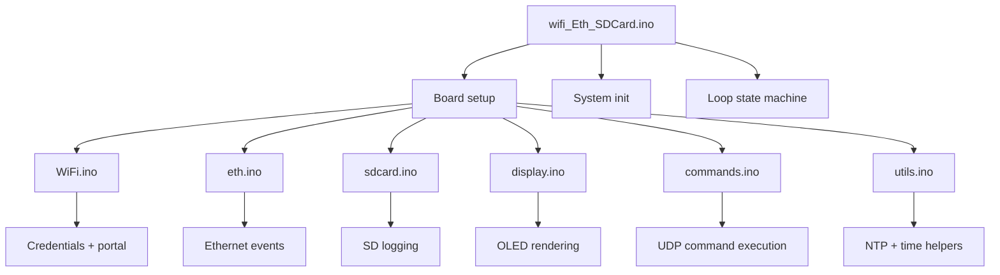
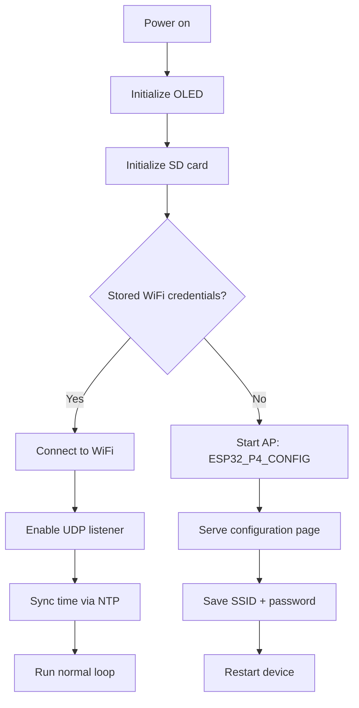

# ESP32 WiFi + Ethernet + SD Card + OLED Control Platform

A robust embedded project built around the ESP32-P4 DevKit that combines Wi-Fi, Ethernet, SD card logging, OLED status display, local configuration portal, and UDP command control in a single firmware platform.

This repository is organized as a set of Arduino/ESP32 `.ino` files that implement a complete device controller for monitoring and managing an ESP32-P4 system from a networked client while keeping an operation log on an SD card and showing status on an OLED display.

<div align="center">
  
</div>

## Overview

The firmware can operate in two communication modes:

- Wi-Fi station mode, connecting to a stored SSID/password
- Wi-Fi AP mode, launching a captive configuration portal when no credentials are saved
- Ethernet fallback/parallel interface using the ESP32-P4 MAC/PHY support
- SD card logging for diagnostics and system events
- UDP-based command interface for remote control and telemetry
- OLED display for live system status
- NTP-based clock synchronization for log timestamps

This design is intended for embedded monitoring, remote diagnostics, data acquisition, and simple command-and-control applications.

---

## System Architecture

### High-level functional block diagram

```mermaid
flowchart LR
    A[User / Client PC] -->|UDP commands| B[ESP32-P4]
    B --> C[WiFi STA / AP]
    B --> D[Ethernet PHY]
    B --> E[OLED Display]
    B --> F[SD Card Logger]
    B --> G[NTP Time Sync]
    B --> H[GPIO / LED / Reset]
    B --> I[Temperature Sensor]

    C --> J[Internet / Local Network]
    D --> J
    F --> K[/log.txt on SD]
    G --> L[RTC Time]
    E --> M[Status Feedback]
    I --> N[Temperature Telemetry]
```

### Hardware dataflow

```text
+-------------------+        +-------------------+
|  Client / Host    | ----> |  UDP Command Port |
|  (PC / app / test)|       |  4210             |
+-------------------+       +-------------------+
                                  |
                                  v
                     +-------------------------------+
                     | ESP32-P4 DevKit              |
                     |                               |
                     |  Wi-Fi STA / AP              |
                     |  Ethernet PHY               |
                     |  NTP Sync                   |
                     |  Preferences storage        |
                     |  SD card logging            |
                     |  OLED status display        |
                     |  GPIO control               |
                     +-------------------------------+
                                  |
                 +----------------+----------------+
                 |                                 |
                 v                                 v
      +-------------------+             +-------------------+
      | LED / reset       |             | SdCard / log.txt  |
      | control           |             | flash memory      |
      +-------------------+             +-------------------+
                 |
                 v
      +-------------------+
      | Temperature Sensor|
      +-------------------+
```

### Conceptual electrical schematic

```text
ESP32-P4 DevKit
  ----------------------------------------------------
  |            +-------------------+                 |
  |            | OLED 128x64      |                 |
  |  GPIO7  ---I2C SDA ---------------+             |
  |  GPIO8  ---I2C SCL ---------------+             |
  |                                  |             |
  |  GPIO1  --- LED --------------------+             |
  |  GPIO2  --- RESET BUTTON ---------------------|
  |                                                |
  |  ETH PHY                                      |
  |  GPIO31 --- MDC                                |
  |  GPIO52 --- MDIO                               |
  |  GPIO51 --- PHY POWER / RESET                  |
  |                                                |
  |  SD_MMC Slot (native hardware)                 |
  |  (No external wiring required on P4 devkit)    |
  |                                                |
  ----------------------------------------------------
```

---

## Hardware Connections

| Function | ESP32-P4 Pin | Note |
| --- | --- | --- |
| OLED SDA | GPIO7 | I2C bus |
| OLED SCL | GPIO8 | I2C bus |
| LED | GPIO1 | Status output |
| Reset button | GPIO2 | Input with pull-up |
| Ethernet MDC | GPIO31 | RMII/PHY management |
| Ethernet MDIO | GPIO52 | PHY management |
| Ethernet PHY power/reset | GPIO51 | PHY reset/control |
| NTP / network access | Network stack | Wi-Fi and Ethernet |
| SD card | SD_MMC native hardware | FAT32 / exFAT |

> Note: This project targets the ESP32-P4 DevKit hardware configuration and expects the PHY to be compatible with the `ETH_PHY_IP101` definition, with `ETH_PHY_GENERIC` as a fallback if the ID does not match.

---

## Features

- Automatic Wi-Fi credential storage using `Preferences`
- Wi-Fi configuration web portal at `http://192.168.4.1`
- Synchronization with NTP servers for valid timestamps
- Ethernet initialization and route priority configuration
- SD card mount and log writing to `/log.txt`
- OLED display update with rolling message history
- UDP request/response command interface
- Temperature sensor reading for ESP32-P4
- LED control and blinking modes
- File listing and reading from SD card by remote command
- Reset button support to clear Wi-Fi settings

---

## Firmware Files

This repository includes the following `.ino` modules:

- `wifi_Eth_SDCard.ino` — main application setup, initialization, and loop logic
- `Wifi.ino` — Wi-Fi connection and configuration portal management
- `eth.ino` — Ethernet initialization and route priority logic
- `sdcard.ino` — SD card mount and log handling
- `display.ino` — OLED log/history rendering
- `commands.ino` — command execution, telemetry, and remote control API
- `utils.ino` — NTP/time utilities and system helpers

### File responsibility map



---

## Main Operational Logic

### Startup sequence

1. Serial console starts at `115200` baud
2. Board LED and reset button are configured
3. I2C bus and OLED display are initialized
4. SD card is mounted
5. Wi-Fi credentials are checked from flash
6. If credentials exist, the ESP32 connects to Wi-Fi
7. If not, Wi-Fi AP mode is activated and configuration portal launches
8. Ethernet is initialized and route priorities are adjusted
9. NTP synchronization is attempted
10. The device begins receiving UDP commands and logging events

### Wi-Fi and configuration flow



---

## Data Flow and Control Cycle

### UDP control flow

```text
Command source (PC / app / script)
          |
          v
     UDP packet on port 4210
          |
          v
    executes in commands.ino
          |
          +--> LED control
          +--> Get temperature
          +--> Report CPU / RAM / Flash
          +--> List SD files
          +--> Read / delete files
          +--> Reset Wi-Fi configuration
          +--> Log message to OLED + serial + UDP
```

### Logging flow

```text
System event --> Serial log --> OLED status --> SD log file /log.txt
     |
     +--> NTP timestamp if available
```

---

## Command Interface

The project listens on UDP and interprets commands from the remote client.

### Supported commands

| Command | Description |
| --- | --- |
| `RESET_WIFI` | Clears stored Wi-Fi settings and restarts the device |
| `LED_ON` | Switches LED on |
| `LED_OFF` | Switches LED off |
| `TEMP` | Returns the current P4 temperature in °C |
| `CPU` | Returns CPU model, revision, core count, frequency, free RAM |
| `RAM` | Returns heap memory metrics |
| `FLASH` | Returns flash size and usage metrics |
| `INIT` | Returns reset reason |
| `UPTIME` | Returns uptime in milliseconds |
| `MAC` | Returns MAC address |
| `NET_INFO` | Reports IP, gateway, mask, RSSI, and SSID |
| `LED_PISCA:x:y` | Flashes LED `x` times with `y` ms interval |
| `LED_BLINK:n` | Enables continuous LED blinking at `n` ms |
| `LIST` | Lists files on the mounted SD card |
| `READ:path` | Reads the contents of a file from the SD card |
| `DEL:path` | Deletes a file from the SD card |

### Example usage

```text
LED_ON
LED_OFF
TEMP
NET_INFO
LIST
READ:/log.txt
DEL:/test.txt
LED_BLINK:500
LED_PISCA:5:200
RESET_WIFI
```

---

## Configuration Portal

When no Wi-Fi credentials are stored, the ESP32 starts an access point named:

```text
ESP32_P4_CONFIG
IP: 192.168.4.1
```

The portal exposes a simple HTML form for entering:

- Network name (SSID)
- Password

After saving, the device stores the values in non-volatile memory and restarts to connect automatically.

---

## SD Card Logging

The SD card module writes a log file at:

```text
/log.txt
```

The log writes time-stamped messages if NTP synchronization has succeeded. If time is unavailable, it writes a fallback marker such as `Sem Hora Sinc.`

Example log entry:

```text
[24/09/2026 09:42:12] WiFi Conectado!
[24/09/2026 09:42:15] Interface Ethernet iniciada.
```

---

## NTP and Time Synchronization

The project uses NTP servers including:

- `a.st1.ntp.br`
- `pool.ntp.org`
- `200.160.7.186`

This allows log timestamps to be generated consistently and gives a reliable time base for system diagnostics and event tracking.

---

## Build and Upload

### Required libraries

- `WiFi.h`
- `WiFiUdp.h`
- `WebServer.h`
- `Preferences.h`
- `ETH.h`
- `Wire.h`
- `Adafruit_GFX.h`
- `Adafruit_SSD1306.h`
- `FS.h`
- `SD_MMC.h`
- `time.h`
- `esp_sntp.h`
- `esp_netif.h`

### Recommended Arduino environment

- Board: `ESP32 P4 Dev Module` / P4-compatible target
- Flash mode: as recommended by board package
- Port: correct USB/serial port for the ESP32-P4
- Upload method: Arduino IDE / VS Code + PlatformIO (if supported by board package)

---

## Important Notes

- `ETH_PHY_IP101` is used by default. Some boards may require `ETH_PHY_GENERIC` if the detected PHY ID does not match.
- The project sets route priority to prefer Wi-Fi for internet traffic and Ethernet for a secondary route, which may be adjusted depending on the application.
- The system starts in AP mode if no saved SSID exists, which makes it easy to recover or reconfigure without reprogramming the board.
- The LED is used for visual state, flashing, and debugging.

---

## Troubleshooting

### OLED not displaying

- Check the I2C wiring on SDA/SCL
- Verify the display address `0x3C`
- Confirm `Wire.begin(PIN_SDA, PIN_SCL)` is executed before `display.begin()`

### SD card not detected

- Make sure the SD card is formatted as FAT32 or exFAT
- Confirm the card is seated correctly
- Review serial logs for `Falha ao montar o Cartao SD!`

### Wi-Fi won’t connect

- Clear saved settings using `RESET_WIFI`
- Confirm the SSID/password match the local access point
- Check whether the device is in AP mode and reconfigure it

### Ethernet not working

- Verify the PHY type and address
- Check the physical cable and link status
- Confirm the board uses compatible Ethernet pins

---

## Repository Structure

```text
esp32_wifi_eth_sdcard_P4/
├── README.md
├── Wifi.ino
├── commands.ino
├── display.ino
├── eth.ino
├── sdcard.ino
├── utils.ino
├── wifi_Eth_SDCard.ino
└── LICENSE (if added by project owner)
```

---

## Summary

This project is a multifunction embedded platform that combines connectivity, telemetry, control, and persistence into a single ESP32-P4 firmware system. It is well suited for:

- network automation gateways
- industrial test nodes
- monitoring devices
- remote logging systems
- educational ESP32 prototypes
- simple embedded control applications

It is structured in a modular way, making it easy to extend with additional features such as MQTT, JSON APIs, sensor integration, web dashboards, OTA updates, or data export routines.

---

## Project Status

- Core Wi-Fi configuration and portal: implemented
- Ethernet handling: implemented
- SD card logging: implemented
- OLED display: implemented
- UDP command console: implemented
- NTP synchronization: implemented
- Remote telemetry + diagnostics: implemented

This is a practical, production-ready foundation for ESP32-P4-based instrumentation and remote management.

---

## Credits

This project was assembled as a modular ESP32-P4 firmware platform for Wi-Fi, Ethernet, SD logging, and remote command control.

If you want, I can also generate:

- a more polished GitHub-style README in English only
- a version with real hardware schematics in KiCad format
- a version tailored for a product/company landing page
- a README with a custom logo and badges
- a detailed BOM for the hardware wiring

